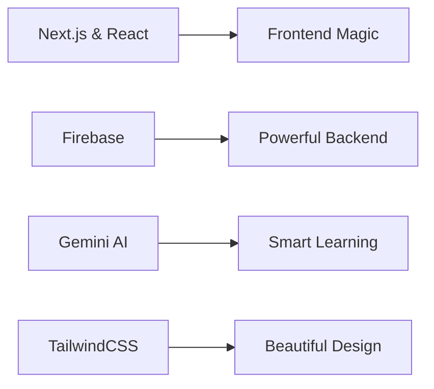

# 🎓 Saarathi - Your AI Study Companion

<div align="center">
  
  <p><em>Transform the way you learn, one flash card at a time</em></p>
</div>

## 🌟 Welcome to Saarathi

Ever wished your study materials could transform into engaging, interactive learning experiences? That's exactly what Saarathi does! Our platform uses the power of AI to turn your notes and documents into smart flashcards and quiz questions, making learning more effective and enjoyable.

### Why Choose Saarathi?

At Saarathi, we believe that learning should be engaging, efficient, and tailored to your needs. Our AI-powered platform takes your study materials and transforms them into interactive learning tools that help you retain information better and study smarter, not harder.

## ✨ What Makes Saarathi Special

🎯 **Smart MCQ Generation**
- Transform your study materials into relevant multiple-choice questions
- AI-powered question generation ensures comprehensive topic coverage
- Perfect for exam preparation and self-assessment

📚 **Interactive Flashcards**
- Create dynamic flashcards from your notes instantly
- Spaced repetition system for optimal learning
- Track your progress and focus on challenging concepts

📱 **Seamless Experience**
- Upload PDFs and documents effortlessly
- Secure user accounts to save your progress
- Responsive design that works on all your devices
- Premium features for power users

⚡ **Lightning-Fast Processing**
- Powered by Google's Gemini AI
- Real-time content generation
- Instant feedback and results

## 🛠️ Built with Modern Technology

We've carefully chosen our tech stack to provide you with the best possible experience:



- 🚀 **Frontend**: Next.js + React for lightning-fast performance
- 🔥 **Backend**: Firebase ecosystem for reliable services
- 🤖 **AI Brain**: Google Gemini API for intelligent content generation
- 💅 **Styling**: TailwindCSS for sleek, responsive design

## 🚀 Getting Started

### Before You Begin

Make sure you have these essentials:

- 📦 Node.js (v16 or higher)
- 📦 npm or yarn
- 🔥 Firebase account
- 🤖 Gemini API key

### Quick Setup Guide

1. **Clone & Navigate**
   ```bash
   git clone https://github.com/SomeshTalligeriDEV/Saarathi_SIH.git
   cd Saarathi_SIH
   ```

2. **Install Magic Dependencies**
   ```bash
   npm install
   # or
   yarn install
   ```

3. **Set Up Your Environment**
   Create a `.env.local` file with your magical keys:
   ```env
   NEXT_PUBLIC_FIREBASE_API_KEY=your_api_key
   NEXT_PUBLIC_FIREBASE_AUTH_DOMAIN=your_auth_domain
   NEXT_PUBLIC_FIREBASE_PROJECT_ID=your_project_id
   NEXT_PUBLIC_FIREBASE_STORAGE_BUCKET=your_storage_bucket
   NEXT_PUBLIC_FIREBASE_MESSAGING_SENDER_ID=your_sender_id
   NEXT_PUBLIC_FIREBASE_APP_ID=your_app_id
   NEXT_PUBLIC_FIREBASE_MEASUREMENT_ID=your_measurement_id
   ```

4. **Launch the App**
   ```bash
   npm run dev
   # or
   yarn dev
   ```

🌟 Visit [http://localhost:3000](http://localhost:3000) to see your personal learning companion in action!

## 📚 Your Learning Journey

Get ready to transform your study experience:

1. 🔐 **Create Your Account**
   - Sign up in seconds
   - Secure your personal learning space
   - Access your materials anywhere

2. 📤 **Upload Your Study Materials**
   - Drag and drop your PDFs
   - Support for various document formats
   - Instant processing

3. 🎮 **Choose Your Learning Mode**
   - MCQ Mode: Test your knowledge
   - Flashcard Mode: Perfect for quick review
   - Both powered by smart AI

4. 📈 **Track Your Progress**
   - See your improvement over time
   - Identify areas needing focus
   - Celebrate your achievements!

## 🤝 Join Our Community

We love contributions from fellow learners and developers! Here's how you can help:

1. 🍴 Fork the repository
2. 🌿 Create your feature branch: `git checkout -b feature/AmazingFeature`
3. 💫 Add your magic: `git commit -m 'Add some AmazingFeature'`
4. 🚀 Push your changes: `git push origin feature/AmazingFeature`
5. 🎉 Open a Pull Request and celebrate!

## 📜 License

This project is licensed under the MIT License - see the [LICENSE](LICENSE) file for details.

## 📫 Let's Connect!

Got questions? Ideas? Just want to say hi? Reach out!

- 👨‍💻 **Somesh Talligeri** 
  - 🐦 Twitter: [@SomeshTalligeri](https://twitter.com/SomeshTalligeri)
  - 💼 LinkedIn: [Somesh Talligeri](https://linkedin.com/in/someshtalligeri)

🔗 Project Home: [Saarathi on GitHub](https://github.com/SomeshTalligeriDEV/Saarathi_SIH)


